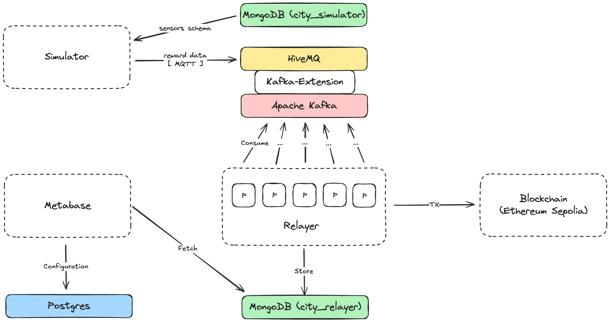

# city.fun

## Table of Contents

- [Overview](#overview)
- [Architecture](#architecture)
- [Getting Started](#getting-started)
  - [Prerequisites](#prerequisites)
  - [Configuration](#configuration)
  - [Running the Infrastructure](#running-the-infrastructure)
  - [Running the Applications](#running-the-applications)
  - [Setting up Metabase](#setting-up-metabase)
- [Services](#services)
- [Development](#development)

## Overview

<div align="justify">
City.fun is a blockchain-based smart city reward system that simulates IoT sensor networks and distributes rewards to participants based on sensor data. The system integrates multiple technologies including MQTT for sensor communication, Kafka for message streaming, MongoDB for data persistence, and Ethereum smart contracts for reward token distribution.

The platform consists of two main components: a **Simulator** that emulates city sensors (such as air quality monitors and environmental sensors distributed around Palermo, Buenos Aires), and a **Relayer** that processes sensor data and mints reward tokens on the Ethereum blockchain (Sepolia testnet).
</div>

## Architecture

<br>



<div align="justify">

> The system follows a event-driven architecture with the following data flow:

1. **Sensor Simulation**: The simulator reads sensor configurations from MongoDB (location, parameters, reward amounts) and publishes simulated sensor data via MQTT to HiveMQ broker.

2. **MQTT to Kafka Bridge**: HiveMQ acts as a bridge, forwarding MQTT messages to Kafka topics for reliable message queuing and processing.

3. **Reward Processing**: The relayer service consumes messages from Kafka, validates sensor data, and stores reward records in MongoDB using latitude/longitude as unique identifiers.

4. **Blockchain Integration**: After database persistence, reward transactions are queued for blockchain processing. The relayer mints ERC-20 reward tokens on Ethereum Sepolia testnet using smart contracts.

5. **Analytics**: Metabase provides real-time dashboards and analytics for monitoring sensor activity, reward distribution, and system performance.

</div>

## Getting Started

### Prerequisites

Before running the system, ensure you have the following installed:

1. **Docker Desktop** - [Install Docker Desktop](https://www.docker.com/products/docker-desktop/) for your operating system (macOS, Windows, or Linux)
2. **Ethereum Wallet** - A private key for an Ethereum wallet (will be used to mint reward tokens on Sepolia testnet)
3. **Alchemy Account** - An [Alchemy](https://www.alchemy.com/) API key for Ethereum RPC endpoint (free tier is sufficient)
4. **Git** - For cloning the repository

### Configuration

#### 1. Clone the Repository

```bash
git clone https://github.com/yourusername/city.fun.git
cd city.fun
```

#### 2. Set up Environment Variables

Copy the example environment file and configure it:

```bash
cp .env.example .env
```

Edit the `.env` file with your preferred text editor:

```bash
# MongoDB Configuration
MONGO_ROOT_USERNAME=root
MONGO_ROOT_PASSWORD=your_secure_password_here
MONGO_PORT=27017

# PostgreSQL Configuration (for Metabase)
MB_DB_TYPE=postgres
MB_DB_DBNAME=metabase
MB_DB_PORT=5432
MB_DB_USER=metabase
MB_DB_PASS=your_metabase_password_here
MB_DB_HOST=postgres

# Relayer Blockchain Configuration
RELAYER_BLOCKCHAIN_ID=11155111  # Sepolia testnet chain ID
RELAYER_AUTH_KIND=private_key_file
RELAYER_REWARD_TOKEN_ADDRESS=0x7A6C2Df222dF345793c7dF2dB9FC49C127298f29  # Your deployed token address

# Simulator Configuration
SIMULATOR_PUSH_INTERVAL=10  # Interval in seconds between sensor data emissions
```

#### 3. Configure Blockchain Secrets

Create the secrets directory and add your blockchain credentials:

```bash
mkdir -p secrets
```

**a) Add your Ethereum private key:**

```bash
# Option 1: Using echo (replace with your actual private key)
echo "0xyour_private_key_here" > secrets/pk
```

**b) Add your Alchemy RPC endpoint:**

```bash
# Replace YOUR_ALCHEMY_KEY with your actual Alchemy API key
echo "https://eth-sepolia.g.alchemy.com/v2/YOUR_ALCHEMY_KEY" > secrets/blockchain_http_endpoint
```

To get your Alchemy API key:
1. Create a free account at [Alchemy](https://www.alchemy.com/)
2. Create a new app for Ethereum Sepolia testnet
3. Copy the HTTP URL from your app dashboard

#### 4. Verify Secret Files

Ensure both secret files are created correctly:

```bash
ls -la secrets/
# You should see:
# - blockchain_http_endpoint
# - pk
```

### Running the Infrastructure

The infrastructure layer includes all base services: MongoDB, Kafka, Zookeeper, HiveMQ, PostgreSQL, Metabase, and Kafka Control Center.

```bash
docker compose -f compose.infra.yaml up -d
```

This will start:
- **MongoDB** (port 27017) - Sensor and reward data storage
- **PostgreSQL** (port 5432) - Metabase metadata storage
- **Kafka** (port 9092) - Message streaming
- **Zookeeper** (port 2181) - Kafka coordination
- **HiveMQ** (port 1883 for MQTT, 8081 for UI) - MQTT broker
- **Kafka Control Center** (port 9021) - Kafka management UI
- **Metabase** (port 3001) - Analytics dashboard

**Wait for all services to be healthy:**

```bash
docker compose -f compose.infra.yaml ps
```

All services should show status as "healthy" or "running".

### Running the Applications

Once the infrastructure is up and running, start the application services:

```bash
docker compose -f compose.apps.yaml up --build
```

This will:
1. Build Docker images for the Simulator and Relayer (written in Go)
2. Start the **Simulator** - Generates and publishes sensor data via MQTT
3. Start the **Relayer** - Consumes data from Kafka, persists to MongoDB, and mints blockchain rewards

**Monitor the logs:**

```bash
# View all application logs
docker compose -f compose.apps.yaml logs -f

# View only simulator logs
docker compose -f compose.apps.yaml logs -f simulator

# View only relayer logs
docker compose -f compose.apps.yaml logs -f relayer
```

### Setting up Metabase

Metabase provides analytics and visualization for your city sensor data. Since the infrastructure is local, you'll need to configure Metabase each time you restart the infrastructure.

#### 1. Access Metabase

Open your browser and navigate to:

```
http://localhost:3001
```

#### 2. Setup Analytics Dashboard

On first launch, Metabase will ask you to create an admin account:

1. **Set up your account**
   - Email: your-email@example.com
   - Password: Create a secure password
   - Click "Next"

2. **Add your data**
   - Click "I'll add my data later" (we'll add MongoDB manually)

3. **Skip usage data collection** (optional)

#### 3. Connect to MongoDB

After initial setup, connect Metabase to your MongoDB instance:

1. **Go to Settings**
   - Click the gear icon in the top right
   - Select "Admin settings"
   - Click "Databases" in the left menu

2. **Add Database**
   - Click "Add database" button
   - Select **MongoDB** from the database type dropdown

3. **Configure MongoDB Connection**
   ```
   Display name: City Sensors
   Host: host.docker.internal
   Port: 27017
   Database name: city_simulator
   Username: root
   Password: password
   Authentication database: admin
   ```

4. **Save and test connection**
   - Click "Save"
   - Metabase will test the connection
   - You should see a success message

5. **Add Relayer Database (Optional)**
   - Repeat steps above with:
     ```
     Display name: City Relayer
     Database name: city_relayer
     (other settings remain the same)
     ```

#### 4. Explore Your Data

Once connected, you can:

- **Browse Data**: Click "Browse Data" → "City Sensors" → "sensors" table
- **Create Questions**: Build custom queries to analyze sensor data
- **Build Dashboards**: Create visualizations for:
  - Sensor locations on a map (latitude/longitude)
  - Reward distribution over time
  - Sensor data trends (CO2, NO2, particulate matter, etc.)
  - Active sensors by type

**Example Questions to Create:**

1. **Sensor Map**: Visualize sensor locations
   - Table: sensors
   - Columns: latitude, longitude, name
   - Visualization: Pin Map

2. **Reward Amounts**: Track reward distribution
   - Table: sensors
   - Summarize: Sum of amount
   - Group by: receiver
   - Visualization: Bar chart

3. **Sensor Activity**: Monitor data emissions over time
   - Database: city_relayer (if connected)
   - Table: transactions
   - Summarize: Count
   - Group by: created_at (by day)
   - Visualization: Line chart

## Services

### Infrastructure Services (compose.infra.yaml)

| Service | Port | Description | UI Access |
|---------|------|-------------|-----------|
| MongoDB | 27017 | NoSQL database for sensor configs and reward data | - |
| PostgreSQL | 5432 | Metabase metadata storage | - |
| Kafka | 9092, 9094 | Message broker for sensor data streaming | - |
| Zookeeper | 2181 | Kafka cluster coordination | - |
| HiveMQ | 1883 (MQTT), 8081 (HTTP) | MQTT broker with Kafka extension | http://localhost:8081 |
| Control Center | 9021 | Kafka management and monitoring | http://localhost:9021 |
| Metabase | 3001 | Business intelligence and analytics | http://localhost:3001 |

### Application Services (compose.apps.yaml)

| Service | Port | Description | Health Check |
|---------|------|-------------|--------------|
| Simulator | 8082, 8083 | City sensor simulator | http://localhost:8083/readyz |
| Relayer | 8080, 8084 | Blockchain reward relayer | http://localhost:8084/readyz |

## Development

### Project Structure

```
city.fun/
├── contracts/              # Solidity smart contracts for reward tokens
├── infraestructure/        # Infrastructure configuration
│   ├── hivemq/            # HiveMQ MQTT broker config with Kafka extension
│   └── sample.js          # MongoDB seed data for sensors
├── relayer/               # Go-based relayer service
│   ├── cmd/               # Application entrypoints
│   ├── internal/          # Internal business logic
│   │   ├── domain/        # Domain entities (Reward)
│   │   ├── usecase/       # Business use cases
│   │   └── infra/         # Infrastructure layer (MongoDB, Kafka, Blockchain)
│   └── pkg/               # Shared packages
├── simulator/             # Go-based sensor simulator
│   ├── cmd/               # Application entrypoints
│   ├── internal/          # Internal business logic
│   └── pkg/               # Shared packages
├── secrets/               # Blockchain credentials (gitignored)
│   ├── pk                 # Ethereum private key
│   └── blockchain_http_endpoint  # Alchemy RPC URL
├── compose.infra.yaml     # Infrastructure services
├── compose.apps.yaml      # Application services
├── .env.example           # Environment variables template
└── README.md              # This file
```

### Technology Stack

- **Backend**: Go
- **Smart Contracts**: Solidity (Ethereum Sepolia)
- **Databases**: MongoDB 7, PostgreSQL 15
- **Message Queue**: Apache Kafka 7.3
- **MQTT Broker**: HiveMQ with Kafka extension
- **Blockchain RPC**: Alchemy
- **Analytics**: Metabase
- **Containerization**: Docker & Docker Compose

### Modifying Sensor Configurations

Sensors are defined in `infraestructure/sample.js`. Each sensor includes:

```javascript
{
    name: "MICS-6814",                    // Sensor identifier
    latitude: -34.5775,                   // GPS latitude (Palermo, Buenos Aires)
    longitude: -58.4200,                  // GPS longitude
    receiver: "0x4f38EB...6bF",           // Ethereum address for rewards
    amount: "1000000000000000000",        // Reward amount in wei (1 token)
    params: {                             // Sensor data generation parameters
        co2: { min: 0, max: 1000, z: 1.96 },
        co: { min: 0, max: 15, z: 1.96 },
        no2: { min: 0, max: 1130, z: 1.96 },
        mp10: { min: 0, max: 250, z: 1.96 },
        mp25: { min: 0, max: 125, z: 1.96 },
        rad: { min: 1, max: 1280, z: 1.96 }
    }
}
```

After modifying sensors:
1. Stop the infrastructure: `docker compose -f compose.infra.yaml down -v`
2. Restart: `docker compose -f compose.infra.yaml up -d`
3. Rebuild apps: `docker compose -f compose.apps.yaml up --build`

### Stopping Services

**Stop applications only:**
```bash
docker compose -f compose.apps.yaml down
```

**Stop infrastructure (preserves data):**
```bash
docker compose -f compose.infra.yaml down
```

**Stop infrastructure and delete all data:**
```bash
docker compose -f compose.infra.yaml down -v
```

### Getting Help

- **GitHub Issues**: [Report bugs or request features](https://github.com/yourusername/city.fun/issues)
- **Logs**: Always check service logs when debugging
- **Kafka UI**: Monitor message flow at http://localhost:9021
- **HiveMQ Console**: Check MQTT status at http://localhost:8081

Built with ❤️ for smart cities and blockchain innovation.